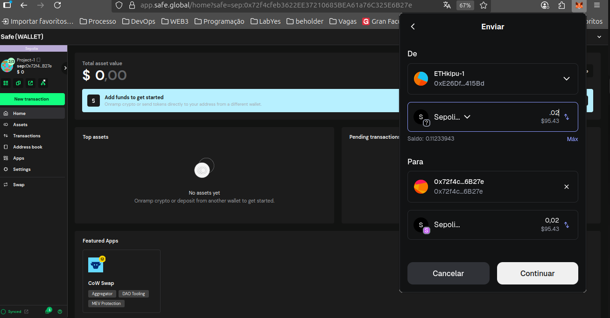
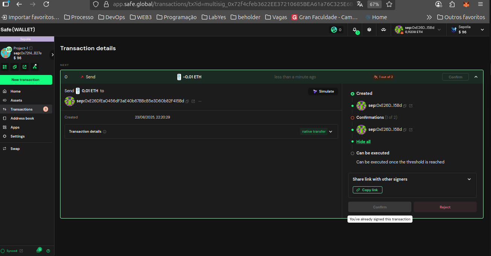

# ETHkipu-Project1
# 🛡️ Demonstration of a Multisig Wallet on Safe

This repository demonstrates the creation and usage of a **multisignature (multisig) wallet** on [Safe (formerly Gnosis Safe)](https://safe.global/).  
The configuration used was **3 wallets in total, requiring 2 signatures to execute transactions**.  

Each step is documented with screenshots to make the process easy to follow.  

---
## 🔑 Safe Multisig Address
https://sepolia.etherscan.io/address/0x72f4cfeb3622EE37210685BEA61a76C325E6B27e

---

## 🔑 Creating the Multisig
In this step, we configured the multisig wallet with 3 owners and the requirement of 2 signatures.  

- Start of creation  
- Setting the name and network  
- Adding the owners  
- Defining the required number of signatures  
- Reviewing and creating the wallet  

  
  
  
  

---

## 📤 Executing Transactions
In this step, we executed a transaction showing how multiple signatures are required.  

- Initiating a transaction  
- Setting the recipient and amount  
- Reviewing the transaction  
- First signature  
- Status waiting for another signature  
- Second signature  
- Automatic transaction execution  

  
  
  
  
  
  
  
  
  
  
  
  
  
  
  
  
  
  
  
  

---

## 📜 Transaction History
All operations are recorded, ensuring transparency and auditability.  

- Transaction list  
- Details of signatures and status  

  
  
  

---

## 🧩 Management and Settings
The multisig allows for security adjustments and participant management.  

- Owner management (add/remove wallets)  
- Security configurations  
- General Safe dashboard  

  
  
  

---

# 📚 Conclusion
This repository shows how to configure and operate a **multisig wallet** on Safe, providing greater security for transactions and shared asset management.  
The **2-of-3 signature setup** ensures flexibility while protecting against failures or unauthorized access.  
